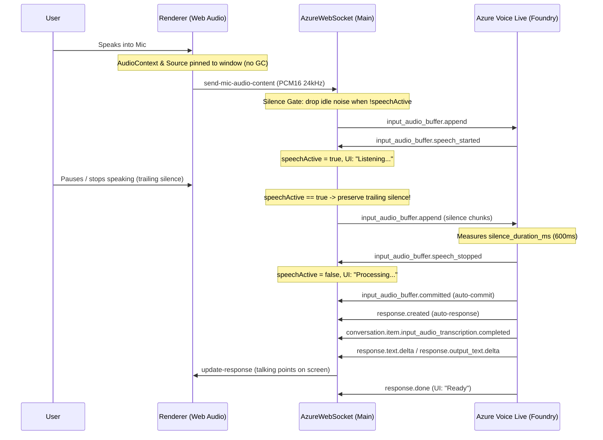

# Unified Azure Realtime & Voice Live Implementation Plan

This document unifies and supersedes the historical fragmented plans in `plan/` (`feature-azure-voice-live-vad-1.md`, `feature-azure-vision-integration.md`, `feature-latency-knowledge-companion.md`) and aligns with `memory-bank/feature-voice-live-webiq-context-memory-1.md`.

---

## 1. Commit Execution Timeline & Audit

The implementation evolved through key commits across four phases:

| Commit | Date (ISO) | Author | Scope & Changes Executed |
|--------|------------|--------|--------------------------|
| `f050afc` / `e6c7a7f` / `f9a7335` | 2025-10-14 | vijaycinn | Initial Azure OpenAI Realtime WebSocket service setup and settings configuration. |
| `8d139b7` | 2025-11-20 | vijaycinn | Added client-side MCP tool integration and localStorage settings. |
| `cb4e53f` | 2025-12-04 | vijaycinn | **VAD Phase 1**: Removed erroneous manual commit inside `speech_stopped` handler ("fix buffer too small"). |
| `1603f94` | 2025-12-12 | vijaycinn | **Step 0**: Implemented manual Pause/Resume button in `AppHeader` and `audioRouter`. |
| `e52670b` / `084907e` | 2026-01-28 | vijaycinn | **Vision**: Integrated Azure Vision (`azureVision.js`) for screenshot analysis via GPT-4.1. |
| `07aeec2` | 2026-03-22 | vijaycinn | Unified Azure auth and vision with realtime improvements. |
| `3029cd8` | 2026-03-30 | vijaycinn | **Auth & VAD Tuning**: Enforced Entra ID bearer token authentication (`cognitiveservices.azure.com/.default`), removed API key configuration, tuned VAD defaults (`semantic_vad`), added silence gate auto-adjustment. |
| `b5bf304` | 2026-07-22 | vijaycinn | **Voice Live MVP**: Switched to Voice Live endpoint (`/voice-live/realtime?api-version=2026-04-10&model=gpt-5.4`), added `SessionContextManager` (L1/L2/L3 memory), `azure_semantic_vad`, talking-point prompt, native MCP servers. |
| `bc5676c` | 2026-07-30 | vijaycinn | **MCP Grounding**: Added `warmUpMCPTools()` for non-blocking connect, server-specific MCP timeout budgets (8s default), approval deduping. |
| `9caa494` / `9089e00` / `e9f1abb` | 2026-07-31 | vijaycinn | Build fixes, packaging cleanup, and Foundry Agent prompt documentation. |
| **Current Fix** | 2026-09-29 | vijaycinn | **VAD Silence & Commit Invariant Fix**: Eliminated rogue `commitAudioBuffer` calls on silence gaps/idle timer during active server VAD; preserved trailing silence during speech for server VAD stop detection; fixed pause commit logic; pinned Web Audio nodes in `renderer.js` against V8 GC. |

---

## 2. Architecture & Invariants

### Core Invariants
1. **Server VAD Exclusivity**:
   - `isServerVadActive()` evaluates both `voice-live` (`semanticVad.enabled !== false`) and `azure-realtime` (`serverVad.enabled !== false && type !== 'none'`).
   - When server VAD is active, client-side commits (`input_audio_buffer.commit`) on `silence_gap` and `idle_timer` are **strictly forbidden**. The server owns turn boundaries and buffer commits.
2. **Trailing Silence Preservation**:
   - When `this.speechActive === false`, silence frames (RMS below threshold) are filtered to conserve bandwidth.
   - When `this.speechActive === true`, silence frames are **forwarded** to Azure so server VAD can observe `silence_duration_ms` (600ms) and trigger `speech_stopped`.
   - A watchdog (`maxTrailingSilenceBytes = 1500ms`) safely releases `speechActive` if a network drop prevents `speech_stopped` from reaching the client.
3. **Manual Pause Mechanics**:
   - Pause force-flushes the accumulator (`force: true`).
   - Only triggers a manual commit if `!isServerVadActive()` (client-managed turns). If forced, it explicitly emits `response.create`.
4. **V8 GC Rooting**:
   - Web Audio `AudioContext`, `MediaStreamAudioSourceNode`, and `ScriptProcessorNode` are rooted at module scope and exposed on `window` to prevent V8 garbage collection mid-stream.
   - All references and contexts are explicitly closed and released in `stopCapture()`.
5. **Entra ID Authentication**:
   - Keyless bearer token auth (`https://cognitiveservices.azure.com/.default`) acquired from Azure CLI (`az login`).
   - Automatic fallback and tenant diagnostics if token tenant does not match resource tenant.

---

## 3. Verification & Test Suite

All changes are validated by the automated test suite:
- `src/__tests__/azureVadSilence.test.js` (NEW):
  - Validates `isServerVadActive()` across Voice Live and Azure Realtime configurations.
  - Verifies silent audio preservation when `speechActive === true` and dropping when `speechActive === false`.
  - Verifies `silence_gap` and `idle_timer` do NOT issue commits when server VAD is enabled.
  - Verifies trailing silence watchdog bounds silence streaming.
- `src/__tests__/azureVoiceLiveLatency.test.js`:
  - Validates MCP tool approval lifecycle, latency budgets, and warm-up.
- `src/__tests__/azureGrounding.test.js`:
  - Validates token claims, auth header resolution, and turn detection parameters.
- Total: **10 test suites, 104 tests passing**.
